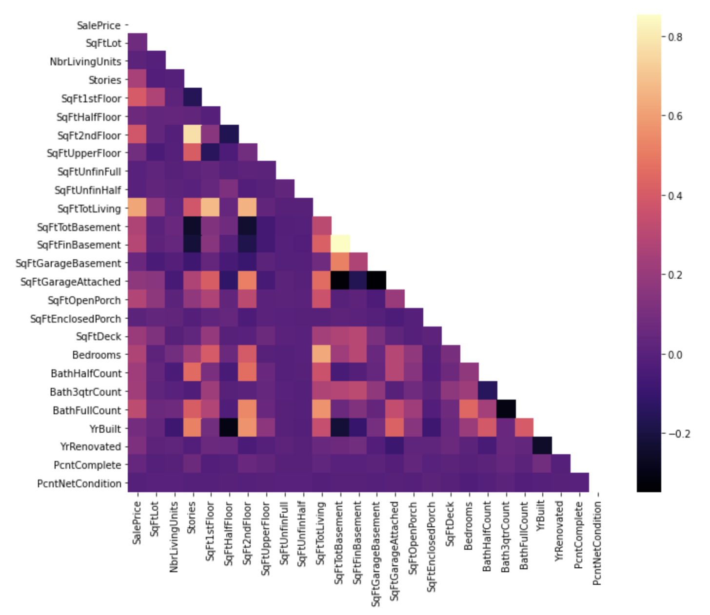

# King County Home Price Analysis

This repository offers an analysis of factors that influence housing prices in King County, WA

## This Repository

### Repository Directory

```
├── README.md        <-- Main README file explaining the project's business case,
│                        methodology, and findings
│
├── data             <-- Data in CSV format
│   ├── processed    <-- Processed (combined, cleaned) data used for modeling
│   └── raw          <-- Original (immutable) data dump
│
├── notebooks        <-- Jupyter Notebooks for exploration and presentation
│
├── references       <-- Data dictionaries, manuals, and project instructions
│
└── reports          <-- Generated analysis (including presentation.pdf)
    └── figures      <-- Generated graphics and figures to be used in reporting
```

### Quick Links

1. [Final Analysis Notebook](notebooks/stats.ipynb)
2. [Presentation Slides](reports/reports)

### Setup Instructions

1. Go into king-county repository.
- `cd ../../king-county`
2. Create your environment by running the following code:
- `conda env create --file project.yml`
3. Acvitvate your already created environment
- `conda activate project`

## Additional Instructions ##

Please make sure to run the `database.ipynb` located in `notebooks/exploratory/` and then `eda_notebook.ipynb` to create the file containing the data that the `stats.ipynb` references for the models.

## Business Understanding

Based on the findings of our [notebook](notebooks/reports/stats.ipynb), it is recommneded for homeowners to do projects that increase their total livigin space, as in doing so, it would substantially increase their home valuation. Using historical data on the Sales Price of different homes, it was found that the more the total living space of a home, the more the Sale would increase.

## Data Understanding

### Visualization 1


A heatmap was used to visualy identify positively correlated features that had an impact on `SalePrice`.

## Visualization 2


After choosing the most positively correlated feeatures we could see, a scatterplot corrlation plot was called to identify which features seemed to have a sense of linearity. Five features, aside from the target, were chosen for this correlation matrix.


## Data Preparation

In order to prepare our data, we chose to only keep data that pertained to residential homes, since we were looking at targetting the increase in value for homeowners. Therefore we filtered our data to homes for single families. We also kept a handful of continuous data columns that seemed like it would have a correlation with the `SalePrice`. We also eventually filtered down to house prices from houses built in 2018. 

## Modeling

### Model 1


### Homoscedasticity Model 1


### Model 2


### Homoscedasticity Model 2


### Model 3


### Homoscedasticity Model 3


### Model 4


### Homoscedasticity Model 4


### Model 5


### Homoscedasticity Model 5


### Model 6


### Homoscedasticity Model 6


## Evaluation

We started off with a base model of SalePrice ~ SqFtTotLiving. It described about 38% of the data and has great p-values under .05. The model seemed statistically significant in its coefficients. In the model we learned that for every Square foot added the price of a house, would on average increase approximately $378.

Note, no years had been filtered.

After checking the linearity assumptions, it was revealed that though there was no violation of the normality or linearity assumption, the data violated the homoscedasticity assumption.

We tried to correct this by filtering outlier data and removing all houses that had a price larger than 2 million. This definitely had an effect on our model since, after running the code again, we got a slightly lower r-squared of .366. The p-values remained low and the t-value seemed to indicate that our coefficients were statistically significant.

I once again ran the homoscedastic test and scatter plot and this time we got different results. the scatter plot seemed more linear but on a slope and the statistical test after seemed to indicate that we failed to reject the null hypothesis and therefore our data was not homoscedastic.

In the third model, using the same dataFrame, we added the feature SqFtOpenPorch. When we ran our model, we got an r-squared of .366. However, the rest of the statistics and coefficients look promising in terms of of a statistical difference. The T-statistic seems to be greater than 0 and the p-values also are at 0. The F-statistic also seems to indicate that the fit of this model is statistically significant. As we can see from the statistics the model has, this model has a Skewness and Kurtosis is close to the shape of a normal distribution.

As we ran the homoscedasticity test, I noticed that the scatter plot looked almost identical to the previous test. In order to account for this failed assumption, I decided to filter the data of houses of year built to a single Year.

The 4th model was built on top of the 3rd model, this time we used only data from houses built in 2018. After running the model, we got an increase in the r-squared of .428 which means that the model described approximately 43% of the variance in house prices. The p-value for the SqFtOpenPorch seem to show that the p-value is large than .05 and thus it appears that there is strong evidence to fail to reject our null hypothesis. This tells us that there is higher probability of the data not being statistically significant.

However, the SqFtTotLiving data point still appears to be smaller than .05 and therefore it provides support to reject our null hypothesis.

After running our tests for normality and linearity it appeared to not violate those assumptions. However, the data was still not homoscedastic.

In order to try to account for this, we built the 5th data model that had a lot of the non-living total square feet area in total and added it to a column. Then we removed the SqFtOpenPorch because the values under that column were added to non_living_SqFt column.

After we ran the model we found that the R-squared stayed relatively the same. It's normality and linearity assumptions passed however we get the same problem with the homoscedastic assumptions.

Then we come to the 6th model where in this case, the non_living_SqFt is logged and the values that were 0 were removed. The model of this data showed an increase in the R-Squared to .044 the p-value on the non_living_SqFt coefficient appeared to be larger than the .05 suggesting that we fail to reject the null hypothesis once again. The SqFtTotLiving remained having a low p-value.

Once again, the normality and linearity assumptions were met. However once again, the homoscedastic assumption was not met.

## Conclusion
After comparing the models, I would say that the model that best represents the data is the 5th model that has the SqFtTotLiving and non_living_SqFt as features. Since the R-squared of most of the later models were very similar at around the mid .40s mark, this was not high in the determining factor. What contributed the mostt on the "relatively low" p-value on the non-living coefficient compared to the 6th model with the logged data. Additionally, the model itself had a low p-value on the regression statistics.

Based on this model, the recommendation that would be given is to increase the total living space of the house to increase its value, as it was found that there was a statistically significant difference in increasing a house's valuation. The difference found was that for every feet added to a house's total living space, the home evaluation would increase on average $246.36.
